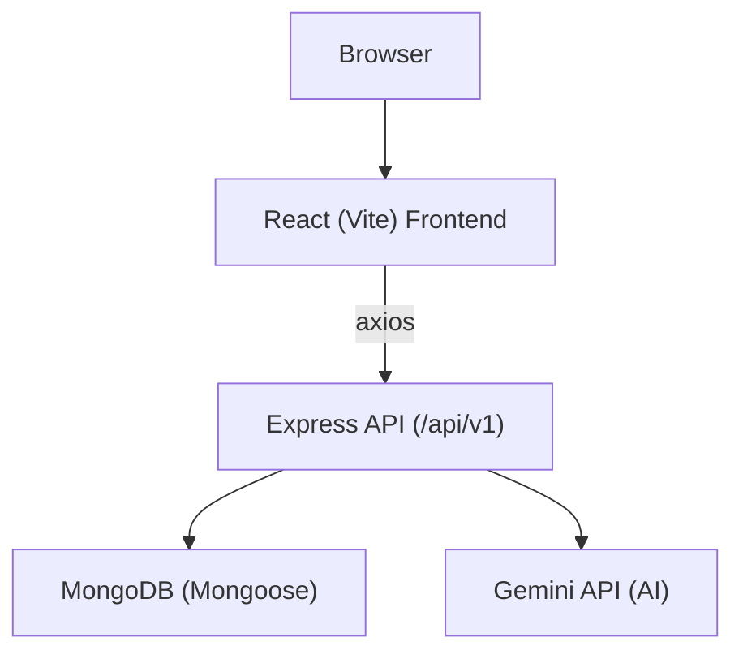

# SnapStack — Architecture

## High-level Overview

SnapStack consists of two main parts:

- Frontend: React single-page application built with Vite. It provides the UI for creating prompts, previewing generated components in a sandbox (Sandpack), and managing user sessions.
- Backend: Express application that exposes REST endpoints under `/api/v1`. The backend handles authentication (JWT), session persistence in MongoDB, and orchestration of AI calls to the Gemini endpoint.

The backend is compatible with serverless deployment (it exports a `handler` using `serverless-http`) and also runs as a local Express server for development.

## Component Diagram (Mermaid)

## Components

- Frontend
  - `Workspace` (new or existing): handles user prompts and displays Sandpack preview.
  - `CodePreview` (uses `@codesandbox/sandpack-react`): shows live preview and code editor.
  - `PromptSider`: chat-like UI for prompts and responses.
  - `AuthContext`: manages login state using localStorage and calls `verifyUser`.

- Backend
  - `userController`: registration, login, and `getMe` endpoints. Issues JWT via `user.getSignedJwtToken()`.
  - `sessionController`: create/refine sessions (calls GeminiController), list sessions, get session by id, edit session code.
  - `GeminiController`: adapter that posts prompts to an external Gemini API URL and extracts JSON `{ title, jsx, css }` from the response.
  - `authMiddleware`: validates JWT token and attaches `req.user`.
  - `config/db.js`: connects to MongoDB using `process.env.MONGO_URI`.

## Backend Architecture Details

- Server entry: `server.js` — connects to MongoDB and either runs Express locally or exports `handler` for serverless environments.
- App definition: `app.js` — sets up middleware and mounts routes:
  - `/api/v1/auth` → `userRoute`
  - `/api/v1/sessions` → `sessionRoute` (protected by `authMiddleware`)
- Serverless-ready: `serverless-http` is used so the Express app can be wrapped as a Lambda handler (see `serverless.yml`).

## Frontend Architecture Details

- Routing: React Router with routes for `/`, `/dashboard`, `/workspace`, `/workspace/:id`, `/login`, `/register`.
- API client: `src/services/api.js` creates an axios instance. In development it uses a proxied `/api/v1` base; in production it uses `VITE_API_URL`.
- Auth: token is stored in `localStorage` and included as `Authorization: Bearer <token>` by the axios interceptor.
- Live preview: `CodePreview.jsx` builds an in-memory Sandpack project with `/App.js` and `/styles.css` so the user can edit and see live updates.

## Database Schema (Mongoose)

- `User` model (in `Server/models/User.js`):
  - `username` (String, required, unique)
  - `email` (String, required, unique)
  - `password` (String, required, stored hashed)
  - `sessions` (Array of ObjectId ref `Session`)

- `Session` model (in `Server/models/Session.js`):
  - `title` (String)
  - `chatHistory` (Array of `{ role: 'user'|'assistant', content: String }`)
  - `jsxCode` (String) — default placeholder component
  - `cssCode` (String)
  - `user` (ObjectId ref `User`, required)

## Data Flow (Detailed)

1. User registers / logs in via `/api/v1/auth/register` or `/api/v1/auth/login`.
2. Backend issues a JWT signed with `process.env.JWT_SECRET`.
3. Frontend stores `token` in `localStorage` and sets Authorization header on requests.
4. To generate/refine a component, frontend `POST /api/v1/sessions` with `{ userPrompt, sessionId? }`.
5. Backend `authMiddleware` validates token, `sessionController` calls `GeminiController`.
6. `GeminiController` posts to `${process.env.GEMINI_API_URL}/v1beta/models/gemini-2.0-flash:generateContent?key=${process.env.GEMINI_API_KEY}` and expects a JSON object in the response.
7. Backend persists the session (`Session` document) and returns it to the frontend.
8. Frontend opens the session in `CodePreview` (Sandpack) for live editing and can `PUT /api/v1/sessions/:id` to save edits.
