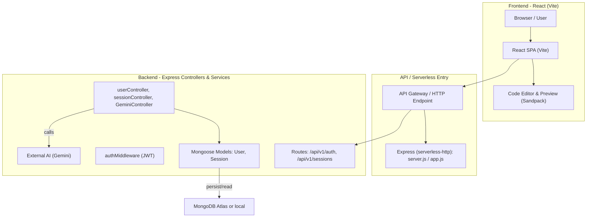

# SnapStack — AI-Powered Component Generator

SnapStack converts plain-language UI requests into working, self-contained React components (JSX + CSS) with a live sandboxed preview and persistent user sessions.

Live demo: `https://snap-stack-pw13.vercel.app/`  
Repository: `https://github.com/mohdajeem/SnapStack`

---

## Overview

Developers often spend time writing repetitive UI boilerplate. SnapStack lets users describe the component they need and returns a complete React component named `App` along with CSS. Generated components can be previewed, edited, refined with follow-up prompts, and persisted as sessions.

## Problem Statement

Creating UI components and iterating on them is time-consuming. There is a need for faster prototyping and iteration that reduces boilerplate while keeping code editable and exportable.

## Solution

SnapStack provides:

- Natural-language → React component generation using an AI model adapter (Gemini adapter present in `Server/controllers/GeminiController.js`).
- Follow-up refinement of generated components (same endpoint, passing `sessionId`).
- Persisted sessions (chat history, JSX, CSS) in MongoDB.
- Live editable preview using Sandpack (`@codesandbox/sandpack-react`).

## Tech Stack (from package manifests)

- Frontend: React (`react` ^18.3.1), Vite (`vite` ^7.0.4), `@codesandbox/sandpack-react` for sandboxed previews.
- Backend: Node.js + Express (`express` ^5.1.0), `serverless-http` for Lambda compatibility.
- Database: MongoDB (via `mongoose` ^8.16.4).
- Auth & Security: JWT (`jsonwebtoken` ^9.0.2), password hashing `bcryptjs`.
- External AI integration: `axios` calls to `GEMINI_API_URL` using `GEMINI_API_KEY`.

See `client/package.json` and `Server/package.json` for full dependency lists.

## Key Features

- Register / Login (JWT) — secure token-based authentication (`Server/controllers/userController.js`).
- Generate and refine components — `POST /api/v1/sessions` (see `Server/controllers/sessionController.js`).
- Persistent sessions — `Session` model stores `title`, `jsxCode`, `cssCode`, and `chatHistory` (`Server/models/Session.js`).
- Live preview and code editing — `client/src/component/CodePreview/CodePreview.jsx` uses Sandpack.
- Client-side auth context — `client/src/context/AuthContext.jsx` stores token + user and auto-verifies on load.

## System Architecture (text + diagram)

High level:

- Browser (React SPA) ↔ Express API (`/api/v1`) ↔ MongoDB
- Backend calls external AI (Gemini) to generate/refine components.

Mermaid snippet (also in `architecture.mmd`):



## Data Flow (request → auth → DB → response)

1. Client sends request (e.g., `POST /api/v1/sessions`) with `Authorization: Bearer <token>` header.
2. `authMiddleware` verifies JWT and sets `req.user` (`Server/middleware/authMiddleware.js`).
3. Controller (e.g., `sessionController`) handles request, calling `GeminiController` when generation/refinement is needed.
4. GeminiController sends prompt to external AI and expects a JSON payload containing `{ title, jsx, css }`.
5. Session is saved to MongoDB and returned to the client.

## API Overview

- `POST /api/v1/auth/register` — register new user. Body: `{ username, email, password }`.
- `POST /api/v1/auth/login` — login. Body: `{ email, password }`. Returns token + user.
- `GET /api/v1/auth/me` — get current user. Requires auth.
- `POST /api/v1/sessions` — create or refine session. Body: `{ userPrompt, sessionId? }`. Requires auth.
- `GET /api/v1/sessions` — list sessions for current user. Requires auth.
- `GET /api/v1/sessions/:id` — get session by id. Requires auth.
- `PUT /api/v1/sessions/:id` — update session code (jsxCode, cssCode). Requires auth.

## Database Models

- `User` (`Server/models/User.js`): `username`, `email`, `password` (hashed), `sessions` (ObjectId[]).
- `Session` (`Server/models/Session.js`): `title`, `chatHistory` (messages), `jsxCode`, `cssCode`, `user` (ObjectId).

## Setup & Installation (local)

Prerequisites:

- Node.js (use a recent LTS version compatible with `package.json`)
- npm
- MongoDB (Atlas or local)

Backend

1. Open a terminal (PowerShell) and run:

```powershell
cd "c:\Users\ajeem\OneDrive\Desktop\MERN Stack\Projects\assignment\Server"
npm install
```

2. Create a `.env` in `Server/` (see `.env.example` at repo root). Minimal variables:

```
MONGO_URI="your-mongo-connection-string"
JWT_SECRET="your_jwt_secret"
GEMINI_API_URL="your_gemini_api_url"
GEMINI_API_KEY="your_gemini_api_key"
PORT=5000
```

3. Start backend (development):

```powershell
npm run dev
```

Frontend

1. Open a new terminal and run:

```powershell
cd "c:\Users\ajeem\OneDrive\Desktop\MERN Stack\Projects\assignment\client"
npm install
```

2. Create a `.env` in `client/` (optional for dev). For production, set `VITE_API_URL`. Example:

```
VITE_API_URL="http://localhost:5000"
```

3. Start frontend (Vite dev server):

```powershell
npm run dev
```

The client will be available at `http://localhost:5173` by default.

## Environment variables (detected in code)

- `MONGO_URI` — MongoDB connection string used by `Server/config/db.js`.
- `JWT_SECRET` — secret used by `User.getSignedJwtToken()`.
- `JWT_EXPIRE` — optional expiration for JWT (default `'30d'` used in code fallback).
- `GEMINI_API_URL` — AI endpoint used in `Server/controllers/GeminiController.js`.
- `GEMINI_API_KEY` — API key appended to Gemini calls.
- `PORT` — backend port (default 5000).
- `VITE_API_URL` — frontend production API base URL (read by `client/src/services/api.js`).

## Deployment

- Frontend: build with `npm run build` inside `client/` and deploy to Vercel or Netlify.
- Backend: can run as a standard Node server or be deployed serverless using `serverless-http` and `serverless.yml` provided in `Server/` (AWS Lambda + API Gateway).
- Database: MongoDB Atlas is recommended for production.

## Live URLs (from repo attachments)

- Frontend demo URL: `https://snap-stack-pw13.vercel.app/` (as provided in project attachments).
- Repository: `https://github.com/mohdajeem/SnapStack`

## Folder structure (selected)

```
client/
  src/
    component/
      CodePreview/
      PromptSider/
      Workspace/
    context/
    pages/
    services/

Server/
  controllers/
  models/
  routes/
  middleware/
  config/

architecture.mmd
.env.example
```

## Testing

- Manual testing steps and sample requests are included in `TESTING_GUIDE.md` in the repository. Important note: AI generation requires valid `GEMINI_API_KEY` and `GEMINI_API_URL`.

## Known limitations

- No automated tests included in repository.
- No refresh token flow for JWT; token rotation is not implemented.
- AI generation depends on an external API and valid credentials.

## Next steps (suggested)

- Add automated tests (Jest + supertest) for controllers and routes.
- Add token refresh / revoke flow.
- Add rate limiting and usage tracking for AI endpoints.

---

If you want, I can also:

- create a Postman collection based on the API endpoints,
- add a brief CONTRIBUTING.md or PR checklist,
- add unit test scaffolding for the backend (Jest + supertest).


